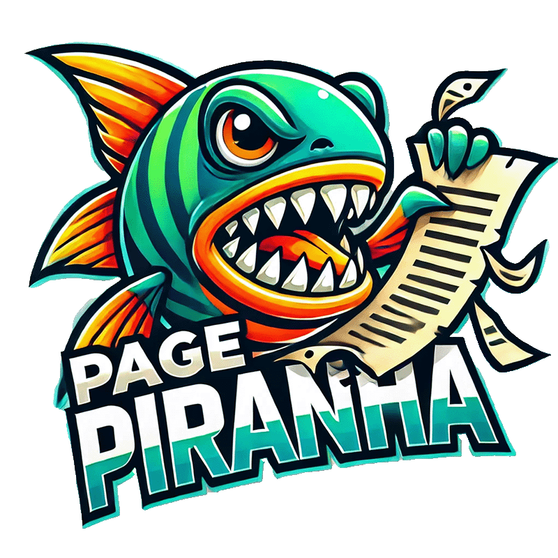

<p align="center">
  
</p>

# Page Piranha 🦈

Use LLMs to convert PDFs to text, markdown, or JSON. By default, page piranha uses the Gemini 2.0 Flash model.

## Features

- Convert PDFs to plain text, markdown, or JSON
- Support for local files and remote URLs
- Pipe-friendly CLI interface
- Progress indicators and colorful output
- Configurable output directory
- Optional custom prompts for fine-tuned conversions

## Installation

```bash
npm install page-piranha
```

## Environment Setup

Page Piranha requires Google Cloud Platform credentials to use Vertex AI. Create a `.env` file with the following variables:

```bash
GCP_PROJECT=your_gcp_project
GCP_LOCATION=your_gcp_location
GOOGLE_APPLICATION_CREDENTIALS=path_to_your_gcp_credentials_file
```

## CLI Usage

Basic usage:

```bash
.bin/page-piranha -f input.pdf -m text -o output
```

Options:

- `-f, --file <file>` - The PDF file to convert (required)
- `-m, --mode <mode>` - Conversion mode: text, markdown, or json (default: text)
- `-o, --outDir <directory>` - Output directory (default: out)
- `-t, --tee` - Output to both file and stdout
- `-v, --verbose` - Enable verbose logging
- `-p, --prompt <prompt>` - Additional hints for conversion

Examples:

# Convert to text

```bash
.bin/page-piranha -f document.pdf -m text
```

# Convert to markdown with custom output directory

```bash
.bin/page-piranha -f document.pdf -m markdown -o converted
```

# Convert to JSON and pipe to jq

```bash
.bin/page-piranha -f assets/demo.pdf -m json -p "Make sure to use camel case. This is an invoice. Feel free to nest fields" -t | jq
```

## Programmatic Usage

Page Piranha can be used programmatically in your TypeScript/JavaScript projects:

```typescript
import { PagePiranha } from 'page-piranha';
import { JorEl } from 'jorel';

// Initialize
const jorEl = new JorEl({ vertexAi: true });
const piranha = new PagePiranha(jorEl);

// Convert to text
const text = await piranha.toText('document.pdf');

// Convert to markdown with additional prompt
const markdown = await piranha.toMarkdown('document.pdf', 'Focus on headers and lists');

// Convert to JSON
const json = await piranha.toJson('document.pdf');
```

## API Reference

### PagePiranha Class

#### Constructor

- `constructor(jorEl: JorEl, options?: PagePiranhaOptions)`

#### Methods

- `toText(fileOrFiles: string | Buffer, additionalPrompt?: string): Promise<string>`
- `toMarkdown(fileOrFiles: string | Buffer, additionalPrompt?: string): Promise<string>`
- `toJson(fileOrFiles: string | Buffer, additionalPrompt?: string): Promise<object>`

## License

MIT